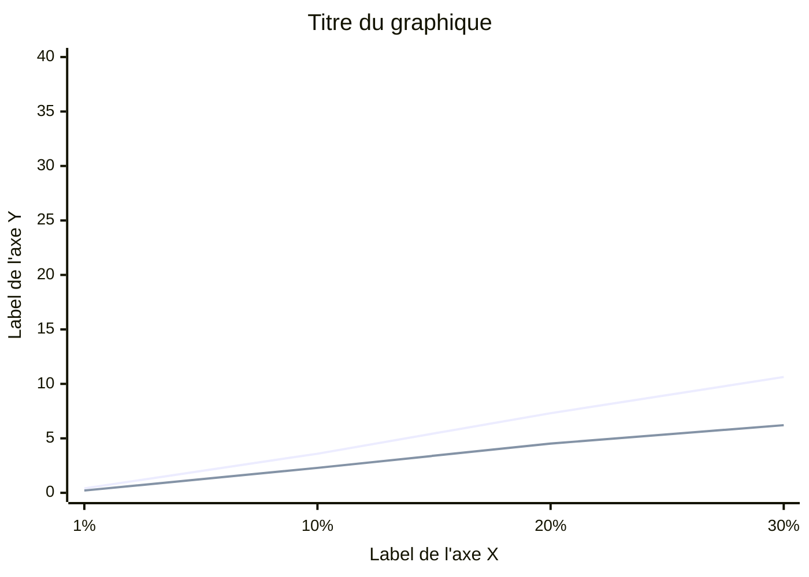

# Comment créer le graphique Mermaid

## Étape 1. Lancer les benchmarks

```bash
go test -bench="Benchmark" -benchmem -run="^$" -count=6 ./...
```

La sortie ressemble à ceci :

```
BenchmarkSineSumInt/1pct-8       3182    406203 ns/op    0 B/op    0 allocs/op
BenchmarkSineSumInt/10pct-8       303   3589801 ns/op    0 B/op    0 allocs/op
...
```

## Étape 2. Convertir ns/op en millisecondes

Diviser chaque valeur `ns/op` par 1 000 000.

| Sortie terminal | Calcul | Résultat |
|:---|:---|:---|
| `406203 ns/op` | 406203 / 1000000 | 0.41 ms |
| `3589801 ns/op` | 3589801 / 1000000 | 3.59 ms |
| `21053744 ns/op` | 21053744 / 1000000 | 21.05 ms |

## Étape 3. Écrire le bloc Mermaid dans le fichier Markdown

La syntaxe `xychart-beta` de Mermaid permet de dessiner des graphiques XY directement dans un fichier `.md`. GitHub les rend automatiquement sans outil externe.

````markdown

````

Chaque `line [...]` ajoute une courbe. Les valeurs doivent être dans le même ordre que les labels de l'axe X.

## Éléments de syntaxe

| Élément | Rôle |
|---------|------|
| `%%{init: ...}%%` | Configuration du thème (fond blanc ici) |
| `xychart-beta` | Type de graphique (XY chart, encore en beta dans Mermaid) |
| `title "..."` | Titre affiché au-dessus du graphique |
| `x-axis "label" [...]` | Axe X avec son nom et ses valeurs catégorielles |
| `y-axis "label" min --> max` | Axe Y avec son nom et sa plage numérique |
| `line [...]` | Une courbe, une par type (Int, Float) |

## Étape 4. Pousser sur GitHub

Le graphique apparaît automatiquement dans le rendu Markdown sur GitHub. Pas besoin d'installer Mermaid localement.

## Référence

- Documentation Mermaid XY Chart : https://mermaid.js.org/syntax/xyChart.html
