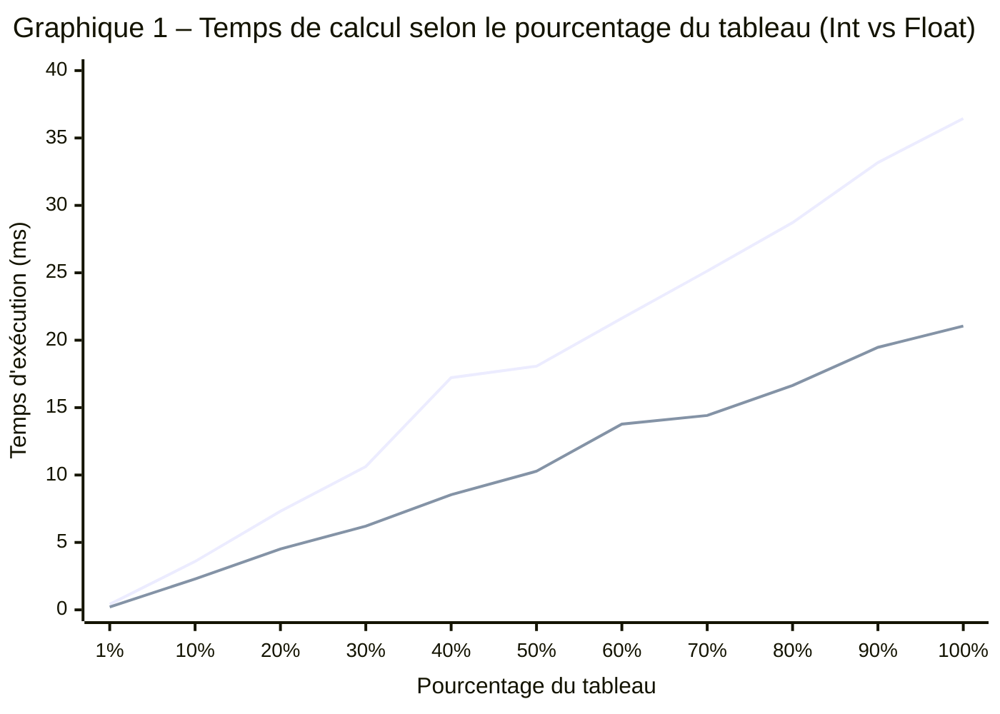

# TN4 – Résultats des benchmarks

## Comment reproduire les résultats

Depuis le dossier `TN4/`, lancer les commandes suivantes dans un terminal.

**Tests unitaires (4 tests)**

```bash
go test -v -run="Test" ./...
```


**Benchmarks complets (22 sous-benchmarks)**

```bash
go test -bench="Benchmark" -benchmem -run="^$" -count=1 ./...
```

Le flag `-run="^$"` exclut les tests unitaires, `-benchmem` active le reporting mémoire, et `-count=1` évite les répétitions inutiles.


**Couverture de code**

```bash
go test -v -cover ./...
```


## Tableau des résultats

| % du tableau | Éléments | Int (ms) | Float (ms) | Ratio Int/Float |
|:---:|:---:|:---:|:---:|:---:|
| 1 % | 10 000 | 0.41 | 0.21 | 1.94× |
| 10 % | 100 000 | 3.59 | 2.29 | 1.57× |
| 20 % | 200 000 | 7.31 | 4.52 | 1.62× |
| 30 % | 300 000 | 10.63 | 6.21 | 1.71× |
| 40 % | 400 000 | 17.22 | 8.54 | 2.01× |
| 50 % | 500 000 | 18.07 | 10.28 | 1.76× |
| 60 % | 600 000 | 21.63 | 13.78 | 1.57× |
| 70 % | 700 000 | 25.13 | 14.42 | 1.74× |
| 80 % | 800 000 | 28.72 | 16.64 | 1.73× |
| 90 % | 900 000 | 33.18 | 19.47 | 1.70× |
| 100 % | 1 000 000 | 36.44 | 21.05 | 1.73× |

Les valeurs en millisecondes sont converties depuis les ns/op affichés par `go test`. Par exemple, `406203 ns/op` donne `0.41 ms`. Aucune allocation mémoire n'a été mesurée (0 B/op, 0 allocs/op) pour les deux types.

## Graphique

Le graphique est généré avec Mermaid (syntaxe `xychart-beta`), qui est rendu automatiquement par GitHub dans les fichiers Markdown.

Les données proviennent directement de la colonne `ns/op` de la sortie des benchmarks. Pour convertir en millisecondes, on divise par 1 000 000. Par exemple, pour `BenchmarkSineSumInt/1pct-8` qui affiche `406203 ns/op`, on obtient `406203 / 1000000 = 0.41 ms`.

Les 11 valeurs Int et les 11 valeurs Float sont ensuite placées dans deux tableaux `line [...]` dans le bloc Mermaid, dans le même ordre que les pourcentages sur l'axe X.



La courbe du haut correspond aux entiers (Int), celle du bas aux flottants (Float). Les deux progressent linéairement, ce qui confirme la complexité O(n). Le ratio moyen Int/Float est de 1.73×, principalement dû à la conversion `float64(v)` exécutée à chaque itération pour les entiers.

## Lecture des résultats

Chaque ligne de la sortie `go test` se lit comme suit :

```
BenchmarkSineSumInt/40pct-8     85     17215340 ns/op     0 B/op     0 allocs/op
│                        │       │     │                  │          │
│                        │       │     │                  │          └─ Allocations par opération
│                        │       │     │                  └─ Mémoire allouée par opération
│                        │       │     └─ Nanosecondes par opération
│                        │       └─ Nombre d'itérations exécutées
│                        └─ Nombre de threads (GOMAXPROCS)
└─ Nom du benchmark / sous-benchmark
```

Le framework `testing.B` ajuste automatiquement le nombre d'itérations (`b.N`) pour obtenir une mesure stable. Plus le benchmark est lent, moins il y a d'itérations.
