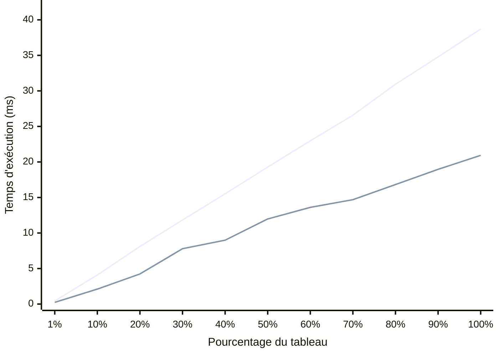

# INF2007 – TN4 – Melissa Moya

## Approche et structure du programme

Le programme calcule la somme des sinus d'un tableau de 1 000 000 d'éléments, en entiers ou en flottants selon le flag `--type`. J'ai séparé le code en trois couches. `generateIntArray` et `generateFloatArray` créent les tableaux avec `rand.NewSource(42)` pour que chaque exécution produise exactement les mêmes données, ce qui est essentiel pour la reproductibilité des benchmarks. J'aurais pu utiliser `crypto/rand`, mais celui-ci fait des appels système à chaque tirage, ce qui fausserait les mesures en mélangeant le coût du calcul avec celui de la génération. `computeSineSumInt` et `computeSineSumFloat` contiennent la boucle de calcul spécialisée pour chaque type, et `computeSineSum` sert de dispatch via un `switch` sur le type reçu en `interface{}`. Les benchmarks passent par `computeSineSum` pour mesurer le programme tel qu'il est réellement exécuté, dispatch inclus. Le surcoût du `switch` et de l'assertion de type est négligeable face à `math.Sin` (environ 1 ns contre 30 ns), mais c'est plus fidèle à l'utilisation réelle.

*Pour les résultats complets des tests, benchmarks et captures d'écran, voir le dossier [Results-and-Instructions](Results-and-Instructions/).*

## Résultats des benchmarks

Les mesures reposent exclusivement sur `testing.B`, le seul outil fiable pour du benchmarking en Go. Les `time.Since` dans `main` ne servent qu'à donner une intuition à l'utilisateur et ne sont pas utilisées dans l'analyse. `testing.B` ajuste automatiquement le nombre d'itérations (`b.N`) pour stabiliser la mesure, et `b.ResetTimer()` est appelé avant chaque boucle pour exclure le setup. Les 22 sous-benchmarks (11 paliers par type) ont été exécutés avec `go test -bench=. -benchmem -count=6` sur un Intel i5-10300H à 2.50 GHz sous Windows/amd64 avec 8 threads, puis analysés avec `benchstat` pour obtenir les médianes et les intervalles de confiance à 95 %. Aucune allocation mémoire n'a été détectée (0 B/op), ce qui confirme que `sum` et les itérateurs restent sur la pile. Le fichier de test contient 13 tests unitaires au total et atteint une couverture de 100 %. En complément des 4 tests demandés, j'ai ajouté des tests sur les valeurs négatives, les flottants extrêmes (`1e15`), le dispatch avec des données incompatibles, la fonction `run` pour chaque type, et `main` elle-même.

**Tableau 1 – Temps de calcul par type et pourcentage du tableau (1 000 000 éléments)**

| % du tableau | Éléments | Int (ms) | Float (ms) | Ratio |
|:---:|:---:|:---:|:---:|:---:|
| 1 % | 10 000 | 0.44 | 0.24 | 1.86× |
| 10 % | 100 000 | 4.09 | 2.11 | 1.94× |
| 20 % | 200 000 | 8.11 | 4.24 | 1.91× |
| 30 % | 300 000 | 11.83 | 7.79 | 1.52× |
| 40 % | 400 000 | 15.52 | 8.99 | 1.73× |
| 50 % | 500 000 | 19.28 | 11.98 | 1.61× |
| 60 % | 600 000 | 22.98 | 13.61 | 1.69× |
| 70 % | 700 000 | 26.58 | 14.69 | 1.81× |
| 80 % | 800 000 | 30.94 | 16.82 | 1.84× |
| 90 % | 900 000 | 34.78 | 18.96 | 1.83× |
| 100 % | 1 000 000 | 38.71 | 20.93 | 1.85× |

Les flottants sont systématiquement plus rapides avec un ratio d'environ 1.5 à 1.9×. En passant de 50 % à 100 %, le temps double presque exactement (19.28 vers 38.71 ms pour Int, 11.98 vers 20.93 ms), ce qui confirme la complexité O(n). Les valeurs proviennent des médianes `benchstat` sur 6 exécutions, avec des intervalles de confiance de ± 1 % pour les paliers les plus longs (90–100 %). Aucune allocation mémoire n'a été détectée (0 B/op). Ces résultats servent de base à l'analyse qui suit.

**Graphique 1 – Temps de calcul selon le pourcentage du tableau (Int vs Float)**

*Pour la méthode de construction du graphique, voir [Guide-creation-graphique-Mermaid.md](Results-and-Instructions/Guide-creation-graphique-Mermaid.md).*

La courbe du haut correspond aux entiers, celle du bas aux flottants. La progression est quasi linéaire pour les deux types, et les courbes restent parallèles sur toute la plage. L'écart entre Int et Float s'explique par la conversion `float64(v)` que la version Int exécute à chaque itération. Sur x86-64, cette conversion se traduit par l'instruction `CVTSI2SD` qui ajoute 4 à 5 cycles par élément. Sur 1 million d'éléments à 2.5 GHz, ça représente environ 2 ms de surcoût pur, mais l'écart observé d'environ 15 ms suggère que la conversion perturbe aussi le pipeline du processeur en cassant la chaîne de dépendances de données. `math.Sin` elle-même utilise une réduction de l'argument suivie d'une approximation polynomiale (Chebyshev) et c'est l'opération qui domine le temps de calcul.

## Applications numériques

Les benchmarks à 100 % du tableau donnent le temps moyen par appel à `math.Sin`. La médiane `benchstat` du benchmark Int est de 38 710 000 ns/op pour 1 000 000 d'éléments, soit $38\,710\,000 \div 1\,000\,000 = 38.7$ ns par sinus. La médiane Float est de 20 930 000 ns/op, soit $20\,930\,000 \div 1\,000\,000 = 20.9$ ns par sinus. Ces deux valeurs servent de base aux questions suivantes.

**Question 1 – Quelle distance parcourt la lumière pendant le calcul d'un sinus ?**

La vitesse de la lumière est $c = 299\,792\,458$ m/s. On multiplie par le temps d'un sinus converti en secondes.

$$d_{int} = 299\,792\,458 \times \frac{38.7}{1\,000\,000\,000} = 11.6 \text{ mètres}$$

$$d_{float} = 299\,792\,458 \times \frac{20.9}{1\,000\,000\,000} = 6.3 \text{ mètres}$$

**Réponse.** La lumière parcourt entre 6 et 12 mètres pendant un seul calcul de sinus, donc ce n'est pas aussi instantané qu'on pourrait le croire.

**Question 2 – Combien de sinus peut-on calculer par tick à 120 fps ?**

Un tick à 120 fps dure $\frac{1}{120} = 8\,333\,333$ ns. On divise par le temps d'un sinus.

$$n_{int} = \frac{8\,333\,333}{38.7} \approx 215\,333 \text{ sinus par tick}$$

$$n_{float} = \frac{8\,333\,333}{20.9} \approx 398\,726 \text{ sinus par tick}$$

**Réponse.** On peut calculer environ 215 000 sinus (Int) ou 399 000 sinus (Float) par tick. En pratique, si on réserve 10 % du budget de frame au calcul de sinus, ça laisse environ 21 500 (Int) ou 39 900 (Float) sinus par tick, ce qui est largement suffisant pour animer un millier d'objets avec des rotations et des oscillations.

*Pour les détails de chaque calcul, voir [Guide-applications-numeriques.md](Results-and-Instructions/Guide-applications-numeriques.md).*

Au final, même une opération mathématique courante comme `math.Sin` a un coût mesurable à l'échelle du processeur, et c'est exactement ce que ce travail permet de quantifier.

### Liens

- Dépôt GitHub [github.com/moyamelissa/Advanced-Programming/tree/main/TN4](https://github.com/moyamelissa/Advanced-Programming/tree/main/TN4)
- Implémentation [sinesum.go](sinesum.go)
- Tests et benchmarks [sinesum_test.go](sinesum_test.go)

### Bibliographie

- Documentation Go `math/rand`, `testing`, `flag` sur https://pkg.go.dev
- Documentation Mermaid XY Chart https://mermaid.js.org/syntax/xyChart.html
- GitHub Copilot, utilisé comme assistant avec vérification systématique des suggestions
