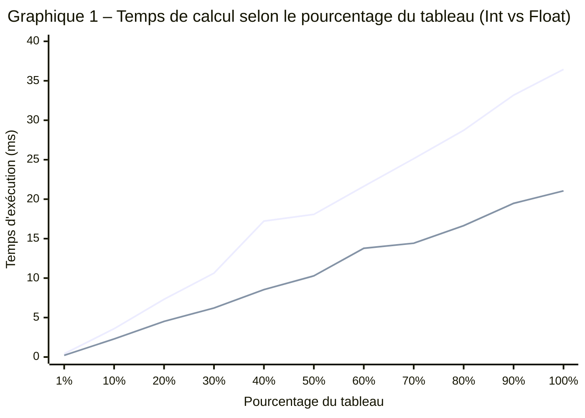

# INF2007 – TN4 – Melissa Moya

 

## Approche et structure du programme

Le programme calcule la somme des sinus d'un tableau de 1 000 000 d'éléments, en entiers ou en flottants selon le flag `--type` (package `flag`, cf. Ch. 5). J'ai séparé le code en trois couches. `generateIntArray` et `generateFloatArray` créent les tableaux avec `rand.NewSource(42)` pour que chaque exécution produise exactement les mêmes données, ce qui est essentiel pour la reproductibilité des benchmarks. J'aurais pu utiliser `crypto/rand`, mais celui-ci fait des appels système à chaque tirage, ce qui fausserait les mesures en mélangeant le coût du calcul avec celui de la génération (cf. Ch. 6). `computeSineSumInt` et `computeSineSumFloat` font le calcul brut dans des boucles spécialisées, et `computeSineSum` sert de dispatch via un `switch` sur le type reçu en `interface{}`. Ce découpage permet aux benchmarks d'appeler directement les fonctions typées pour mesurer uniquement la boucle de calcul, sans le surcoût du dispatch dynamique.

## Résultats des benchmarks

Les mesures ont été obtenues avec `go test -bench=. -benchmem -count=1` sur un Intel i5-10300H à 2.50 GHz (Windows/amd64, 8 threads). Le framework `testing.B` ajuste automatiquement le nombre d'itérations (`b.N`) pour stabiliser la mesure (cf. Ch. 6). Les 22 sous-benchmarks (11 paliers par type) couvrent de 1 % à 100 % du tableau. Aucune allocation mémoire n'a été détectée (0 B/op), ce qui confirme que `sum` et les itérateurs restent sur la pile.

**Tableau 1 – Temps de calcul par type et pourcentage du tableau (1 000 000 éléments)**

| % du tableau | Éléments | Int (ms) | Float (ms) | Ratio |
|:---:|:---:|:---:|:---:|:---:|
| 1 % | 10 000 | 0.41 | 0.21 | 1.94× |
| 10 % | 100 000 | 3.59 | 2.29 | 1.57× |
| 20 % | 200 000 | 7.31 | 4.52 | 1.62× |
| 30 % | 300 000 | 10.63 | 6.21 | 1.71× |
| 40 % | 400 000 | 17.22 | 8.54 | 2.01× |
| 50 % | 500 000 | 18.07 | 10.28 | 1.76× |
| 60 % | 600 000 | 21.63 | 13.78 | 1.57× |
| 70 % | 700 000 | 25.13 | 14.42 | 1.74× |
| 80 % | 800 000 | 28.72 | 16.64 | 1.73× |
| 90 % | 900 000 | 33.18 | 19.47 | 1.70× |
| 100 % | 1 000 000 | 36.44 | 21.05 | 1.73× |

## Analyse des performances

La progression est quasi linéaire pour les deux types. En passant de 50 % à 100 %, le temps double presque exactement (18.07 → 36.44 ms pour Int, 10.28 → 21.05 ms), ce qui confirme la complexité O(n). Les flottants sont systématiquement plus rapides avec un ratio moyen de 1.73×. Cette différence s'explique par la conversion `float64(v)` que la version Int exécute à chaque itération. Sur x86-64, cette conversion se traduit par l'instruction `CVTSI2SD` qui ajoute 4 à 5 cycles par élément (cf. Ch. 5). Sur 1 million d'éléments à 2.5 GHz, ça représente environ 2 ms de surcoût pur, mais l'écart observé de ~15 ms suggère que la conversion perturbe aussi le pipeline du processeur en cassant la chaîne de dépendances de données. `math.Sin` elle-même utilise une réduction de l'argument suivie d'une approximation polynomiale (Chebyshev) et c'est l'opération qui domine le temps de calcul.

## Calculs pour les questions du professeur

Pour obtenir le temps par sinus, on divise le `ns/op` du benchmark à 100 % par le nombre d'éléments. Le benchmark Int à 100 % affiche 36 442 568 ns/op, donc $36\,442\,568 \div 1\,000\,000 = 36.4$ ns par sinus. Pour Float, 21 053 744 ns/op donne $21\,053\,744 \div 1\,000\,000 = 21.1$ ns par sinus.

**Distance parcourue par la lumière pendant un sinus.** La lumière voyage à $c = 299\,792\,458$ m/s. On multiplie par le temps en secondes.

$$d_{int} = 299\,792\,458 \times \frac{36.4}{1\,000\,000\,000} = 10.9 \text{ mètres}$$

$$d_{float} = 299\,792\,458 \times \frac{21.1}{1\,000\,000\,000} = 6.3 \text{ mètres}$$

La lumière parcourt entre 6 et 11 mètres pendant un seul calcul de sinus. C'est la taille d'une pièce d'appartement. On pense que `math.Sin` est instantané, mais la lumière a le temps de traverser un salon pendant ce calcul.

**Nombre de sinus par tick à 120 fps.** Un tick dure $\frac{1}{120} = 8\,333\,333$ ns. On divise par le temps d'un sinus.

$$n_{int} = \frac{8\,333\,333}{36.4} \approx 228\,938 \text{ sinus par tick}$$

$$n_{float} = \frac{8\,333\,333}{21.1} \approx 394\,943 \text{ sinus par tick}$$

En pratique, si on réserve 10 % du budget de frame au calcul de sinus, ça laisse environ 23 000 (Int) ou 39 500 (Float) sinus par tick, ce qui est largement suffisant pour animer un millier d'objets avec des rotations et des oscillations.

*Pour les détails de chaque calcul et les instructions de reproduction, voir [Guide-calculs-questions-professeur.md](Results-and-Instructions/Guide-calculs-questions-professeur.md) et [Guide-creation-graphique-Mermaid.md](Results-and-Instructions/Guide-creation-graphique-Mermaid.md).*

### Liens

- Dépôt GitHub [github.com/moyamelissa/Advanced-Programming/tree/main/TN4](https://github.com/moyamelissa/Advanced-Programming/tree/main/TN4)
- Code principal [sinesum.go](sinesum.go), tests et benchmarks [sinesum_test.go](sinesum_test.go)

### Bibliographie

- Manuel INF2007, chapitres 5 et 6
- Documentation Go `math/rand`, `testing`, `flag` sur https://pkg.go.dev
- Documentation Mermaid XY Chart https://mermaid.js.org/syntax/xyChart.html
- Outil d'IA GitHub Copilot, utilisé comme assistant avec vérification systématique des suggestions
