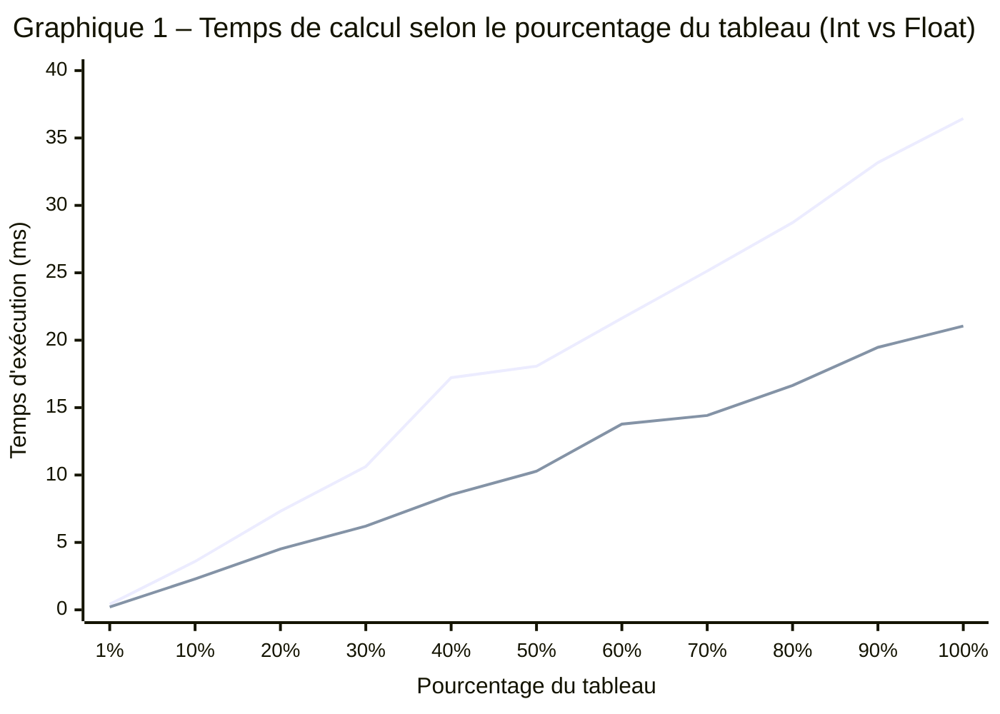

# INF2007 – TN4 – Melissa Moya

 

## Approche et structure du programme

Le programme calcule la somme des sinus d'un tableau de 1 000 000 d'éléments, en entiers ou en flottants selon le flag `--type` (package `flag`, cf. Ch. 5). J'ai séparé le code en trois couches. `generateIntArray` et `generateFloatArray` créent les tableaux avec `rand.NewSource(42)` pour que chaque exécution produise exactement les mêmes données. `computeSineSumInt` et `computeSineSumFloat` font le calcul brut dans des boucles spécialisées, et `computeSineSum` sert de dispatch via un `switch` sur le type reçu en `interface{}`.

Ce découpage n'est pas juste esthétique. Les benchmarks appellent directement les fonctions typées, ce qui mesure uniquement la boucle de calcul sans le surcoût du dispatch dynamique ni de l'assertion de type. La seed fixe à 42 (plutôt que `crypto/rand`) est volontaire. `crypto/rand` ferait des appels système à chaque tirage, ce qui fausserait les mesures en mélangeant le coût du calcul avec celui de la génération (cf. Ch. 6).

## Résultats des benchmarks

Les mesures ont été prises avec `go test -bench=. -benchmem -count=1` sur un Intel i5-10300H à 2.50 GHz (Windows/amd64, 8 threads). Aucune allocation mémoire n'a été détectée (0 B/op, 0 allocs/op) pour les deux types, ce qui confirme que les variables `sum` et les itérateurs restent sur la pile.

| % du tableau | Éléments | Int (ms) | Float (ms) | Ratio |
|:---:|:---:|:---:|:---:|:---:|
| 1 % | 10 000 | 0.41 | 0.21 | 1.94× |
| 10 % | 100 000 | 3.59 | 2.29 | 1.57× |
| 20 % | 200 000 | 7.31 | 4.52 | 1.62× |
| 30 % | 300 000 | 10.63 | 6.21 | 1.71× |
| 40 % | 400 000 | 17.22 | 8.54 | 2.01× |
| 50 % | 500 000 | 18.07 | 10.28 | 1.76× |
| 60 % | 600 000 | 21.63 | 13.78 | 1.57× |
| 70 % | 700 000 | 25.13 | 14.42 | 1.74× |
| 80 % | 800 000 | 28.72 | 16.64 | 1.73× |
| 90 % | 900 000 | 33.18 | 19.47 | 1.70× |
| 100 % | 1 000 000 | 36.44 | 21.05 | 1.73× |

## Analyse des performances

La progression est quasi linéaire pour les deux types, ce qui confirme la complexité O(n). En passant de 50 % à 100 %, le temps double presque exactement (18.07 → 36.44 ms pour Int, 10.28 → 21.05 ms pour Float).

Les flottants sont systématiquement plus rapides, avec un ratio moyen de 1.73×. La différence vient de la conversion `float64(v)` que la version Int exécute à chaque itération. Sur x86-64, cette conversion se traduit par l'instruction `CVTSI2SD` qui ajoute 4 à 5 cycles par élément (cf. Ch. 5). Sur 1 million d'éléments à 2.5 GHz, ça représente environ 2 ms de surcoût pur, mais l'écart observé de ~15 ms suggère que la conversion perturbe aussi le pipeline du processeur en cassant la chaîne de dépendances de données.

`math.Sin` utilise une réduction de l'argument suivie d'une approximation polynomiale (polynômes de Chebyshev). C'est l'opération qui domine le temps de calcul. Le temps moyen par sinus est de 36.4 ns (Int) et 21.1 ns (Float), l'addition `sum +=` ne prenant qu'environ 1 ns en comparaison.

## Questions spéciales

La lumière voyage à environ 299 792 458 m/s. Pendant un seul calcul de sinus, elle parcourt $299\,792\,458 \times 36.4 \times 10^{-9} \approx 10.9$ mètres (Int) et $299\,792\,458 \times 21.1 \times 10^{-9} \approx 6.3$ mètres (Float). C'est la taille d'une pièce d'appartement. On pense que `math.Sin` est instantané, mais la lumière a le temps de traverser un salon pendant ce calcul.

Pour un jeu à 120 fps, chaque frame dispose de 8.33 ms. À 36.4 ns par sinus (Int), on peut en calculer environ 229 000 par frame. En Float, c'est 395 000. En pratique, si on réserve 10 % du budget de frame au calcul de sinus, ça laisse 23 000 (Int) ou 39 500 (Float) sinus par tick, ce qui est largement suffisant pour animer un millier d'objets avec des rotations et des oscillations.

## Annexe

Les résultats détaillés (commandes, capture d'écran du terminal, graphique et explication de lecture) sont dans [TN4-results.md](TN4-results.md).

### Liens

- Dépôt GitHub [github.com/moyamelissa/Advanced-Programming/tree/main/TN4](https://github.com/moyamelissa/Advanced-Programming/tree/main/TN4)

### Fichiers TN4

- Code principal [sinesum.go](sinesum.go)
- Tests et benchmarks [sinesum_test.go](sinesum_test.go)

### Bibliographie

- Manuel INF2007, chapitres 5 et 6
- Documentation Go `math/rand` https://pkg.go.dev/math/rand
- Documentation Go `testing` https://pkg.go.dev/testing
- Documentation Go `flag` https://pkg.go.dev/flag
- Documentation Mermaid XY Chart https://mermaid.js.org/syntax/xyChart.html
- Outil d'IA GitHub Copilot, utilisé comme assistant avec vérification systématique des suggestions
