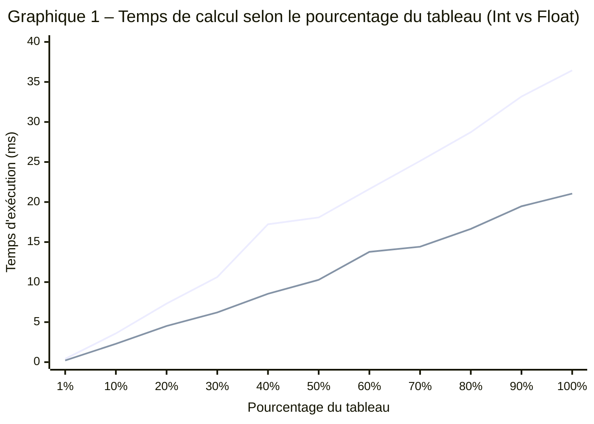

# TN4 – Résultats des benchmarks

## Comment reproduire les résultats

Depuis le dossier `TN4/`, lancer la commande suivante dans un terminal :

```bash
go test -bench="Benchmark" -benchmem -run="^$" -count=1 ./...
```

Cette commande exécute uniquement les benchmarks (pas les tests unitaires grâce à `-run="^$"`) avec le reporting mémoire activé (`-benchmem`). Le flag `-count=1` évite les répétitions inutiles.

Pour les tests unitaires seuls :

```bash
go test -v -run="Test" ./...
```

## Sortie brute du terminal

La capture ci-dessous montre la sortie complète des 22 benchmarks (11 paliers pour Int, 11 pour Float) exécutés sur un Intel i5-10300H à 2.50 GHz (Windows/amd64).


## Tableau des résultats

| % du tableau | Éléments | Int (ms) | Float (ms) | Ratio Int/Float |
|:---:|:---:|:---:|:---:|:---:|
| 1 % | 10 000 | 0.41 | 0.21 | 1.94× |
| 10 % | 100 000 | 3.59 | 2.29 | 1.57× |
| 20 % | 200 000 | 7.31 | 4.52 | 1.62× |
| 30 % | 300 000 | 10.63 | 6.21 | 1.71× |
| 40 % | 400 000 | 17.22 | 8.54 | 2.01× |
| 50 % | 500 000 | 18.07 | 10.28 | 1.76× |
| 60 % | 600 000 | 21.63 | 13.78 | 1.57× |
| 70 % | 700 000 | 25.13 | 14.42 | 1.74× |
| 80 % | 800 000 | 28.72 | 16.64 | 1.73× |
| 90 % | 900 000 | 33.18 | 19.47 | 1.70× |
| 100 % | 1 000 000 | 36.44 | 21.05 | 1.73× |

Les valeurs en millisecondes sont converties depuis les ns/op affichés par `go test`. Par exemple, `406203 ns/op` donne `0.41 ms`. Aucune allocation mémoire n'a été mesurée (0 B/op, 0 allocs/op) pour les deux types.

## Graphique



La courbe du haut correspond aux entiers (Int), celle du bas aux flottants (Float). Les deux progressent linéairement, ce qui confirme la complexité O(n). Le ratio moyen Int/Float est de 1.73×, principalement dû à la conversion `float64(v)` exécutée à chaque itération pour les entiers.

## Lecture des résultats

Chaque ligne de la sortie `go test` se lit comme suit :

```
BenchmarkSineSumInt/40pct-8     85     17215340 ns/op     0 B/op     0 allocs/op
│                        │       │     │                  │          │
│                        │       │     │                  │          └─ Allocations par opération
│                        │       │     │                  └─ Mémoire allouée par opération
│                        │       │     └─ Nanosecondes par opération
│                        │       └─ Nombre d'itérations exécutées
│                        └─ Nombre de threads (GOMAXPROCS)
└─ Nom du benchmark / sous-benchmark
```

Le framework `testing.B` ajuste automatiquement le nombre d'itérations (`b.N`) pour obtenir une mesure stable. Plus le benchmark est lent, moins il y a d'itérations.
